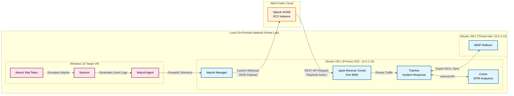

# Automated Threat Detection and Incident Triage using Splunk SOAR

## Demo Video
Watch the full project demo: [Click here](https://1drv.ms/v/c/ca84ccba0e93da2d/IQCOaduqe4PkSbiTWT0drfRfAS1BpGq1HGq-RDu2ThfD-TA?e=G4TGam)

## Overview
Engineered a hybrid-cloud SOC automation pipeline to achieve zero-touch incident triage. Simulated MITRE ATT&CK techniques on a local endpoint and routed the detections to a cloud-hosted SOAR platform. The automated playbook deduplicated alerts, dynamically provisioned analyst tickets in a local IR platform via reverse tunnels, ran threat intel enrichment, and dispatched email notifications in seconds.

## Environment
- Windows VM (10.0.2.10) - attack target with Sysmon, Wazuh Agent, and Atomic Red Team
- Ubuntu VM 1 (10.0.2.15) - primary SOC node with Wazuh Manager, TheHive, Cortex, and ngrok
- Ubuntu VM 2 (10.0.2.12) - dedicated threat intelligence node with MISP
- AWS EC2 Instance (Cloud) - Splunk SOAR Community Edition

## Architecture Diagram
The architecture utilizes a "Cloud-to-Ground" reverse tunnel to securely route REST API payloads from the public AWS cloud directly into the locally hosted private NAT network.

## Automated Pipeline + Attack Simulation

| Stage | Action | Tool | Result |
|---|---|---|---|
| Execution | T1053.005 / T1003.001 simulated | Atomic Red Team | Sysmon telemetry generated |
| Detection | Log correlation and alerting | Wazuh SIEM | Level 10+ High Severity Alert |
| Ingestion | JSON payload pushed via Webhook | Splunk SOAR + ngrok | Event container created in SOAR |
| Orchestration | Playbook logic evaluates duplicates | Splunk SOAR | Duplicate check passed |
| Response | Auto-create ticket & send email | TheHive + SMTP App | Case provisioned, Analyst emailed |
| Enrichment | Active observable analysis | Cortex + VirusTotal | Malicious hash (WannaCry) flagged |

## Key Results
- Bridged on-premise SOC tools with cloud-hosted automation using an `ngrok` reverse tunnel on port 9000.
- Engineered a Splunk SOAR playbook with conditional logic to query TheHive's API and deduplicate alerts before case creation.
- Reduced Tier-1 triage time from manual processing (minutes) to fully automated provisioning (seconds).
- Successfully detected and enriched T1053.005 (Scheduled Task Persistence) and identified signatures via Cortex.
- Exported confirmed IOCs directly to MISP, automatically mapping them to MITRE ATT&CK Galaxy tags.

## Tools Used
Splunk SOAR, Wazuh (SIEM/XDR), TheHive (Incident Management), Cortex (DFIR), MISP (Threat Intelligence Platform), Sysmon, Atomic Red Team, ngrok, AWS EC2, VirtualBox

## Files in This Repo
- [Capstone Project Report](Incident_Triage.pdf)
- [Wazuh Custom Integration Script](scripts/)
- [Screenshots](images/)

## Screenshots
- Splunk SOAR Playbook Canvas

- Auto-Created TheHive Case

- Cortex Analyzer Identification

- Automated Analyst Email Notification

